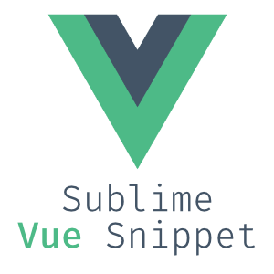

# Vue Sublime Snippets

## Installation

Open Package Control - (Ctrl or ⌘) + ⇧ + P
Type `Vue Snippets`

## Snippets

### Vue

| Snippet | Purpose                    |
| ------- | -------------------------- |
| `vbase` | Single file component base |

### Template

| Snippet           | Purpose                             |
| ----------------- | ----------------------------------- |
| `vclass`          | Class binding                       |
| `vfor`            | v-for directive                     |
| `vif`            | v-if directive                     |
| `vmodel`          | Semantic v-model directive          |
| `von`             | v-on click handler with arguments   |
| `vshow`            | v-show directive                     |
| `vsrc`            | Image src binding                   |
| `vstyle`          | Inline style binding                |

### Script

| Snippet          | Purpose                                                                  |
| ---------------- | ------------------------------------------------------------------------ |
| `vcomputed`      | Vue computed property                                                    |
| `vdata`          | Component data as a function                                             |
| `vdestroyed`        | Vue destroyed                                                               |
| `vdirectives`      | Vue create a custom directive                                            |
| `vfilter`        | Vue filter                                                               |
| `vimport`        | Import one component into another                                        |
| `vmethods`        | Vue methods                                                               |
| `vmixin`         | Create a Vue Mixin                                                       |
| `vmounted`        | Vue mounted                                                               |
| `vprops`         | Props with type and default                                              |
| `vwatch`       | Vue watcher with new and old value args                                  |

### Vuex

| Snippet         | Purpose                        |
| --------------- | ------------------------------ |
| `vactions`       | Vuex Actions                    |
| `vgetters`       | Vuex Getter                    |
| `vmutations`     | Vuex Mutations                  |

## Thanks
Special thank you to [Sarah Drasner](https://twitter.com/sarah_edo), for creating the following repository [vue-vscode-snippet](https://github.com/sdras/vue-vscode-snippets).

## License

**Sublime Vue Snippets** is open-sourced software licensed under the \[MIT license\](http://opensource.org/licenses/MIT)

Created with ♥️ by [@mauroreisvieira](https://twitter.com/mauroreisvieira) in **Portugal**
